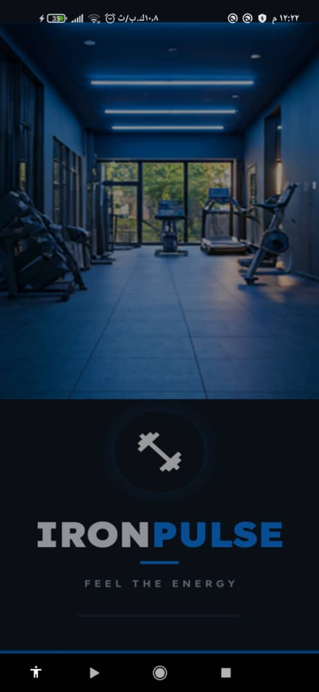
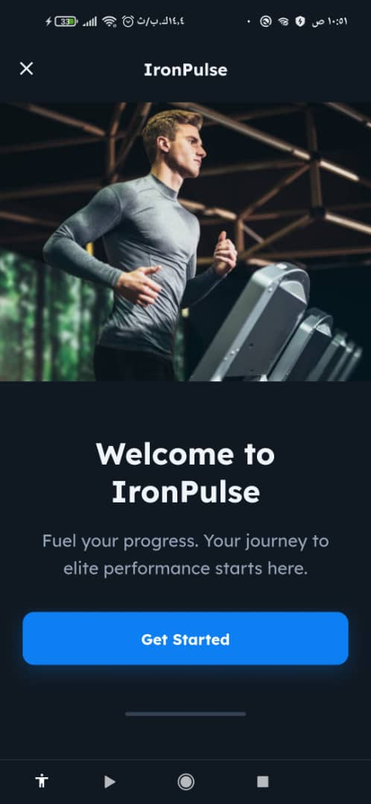
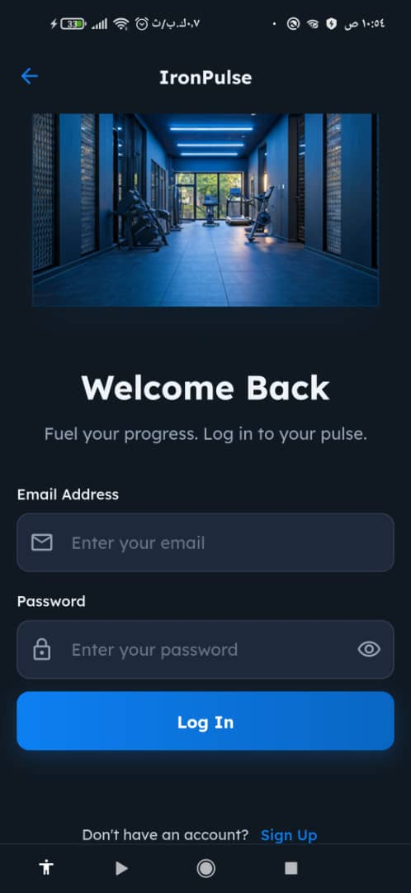
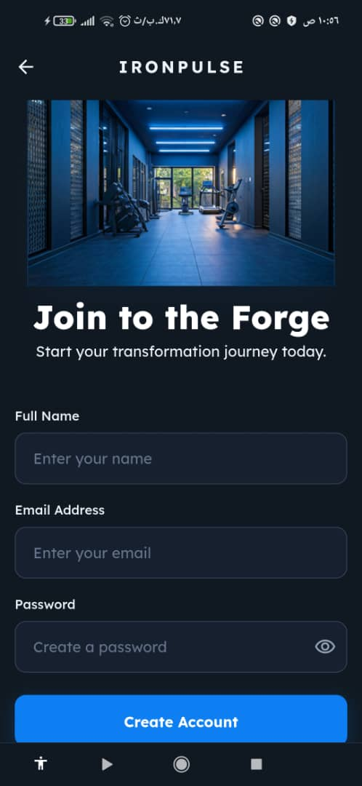
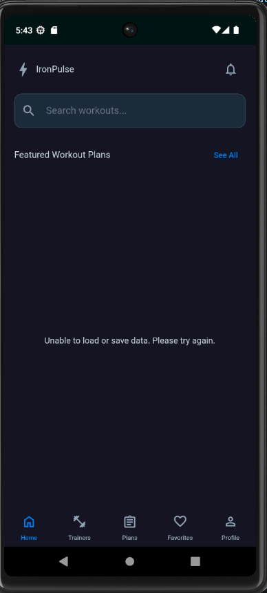
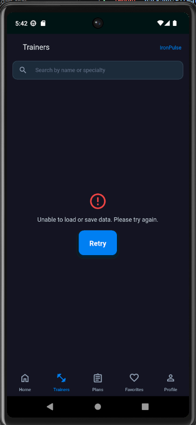

<h1 align="center">💪 IronPulse · FitMate</h1>

<p align="center">
  <strong>Find your plan. Build your strength. Fuel your progress.</strong>
</p>

<p align="center">
  
  
  
  
</p>

---

## 📖 About the App

**FitMate** is the Flutter project behind **IronPulse**, a fitness app that brings workout plans, trainer discovery, favorite plans, and personal profiles together in one place. Its dark interface, blue accents, and clear workout cards help users explore programs and organize their fitness journey.

The app covers the journey from account creation to discovering a training plan, reviewing daily exercises, and keeping preferred plans close at hand. The codebase uses **Cubit**, a feature-based structure, and **Supabase** for authentication and remote data.

## ✨ Features & Ownership

| Feature | What it includes | Owner |
| :--- | :--- | :--- |
| **Splash & Welcome** | Branded native splash screen, welcome page, and the Get Started flow. | **Reem Mohsen** |
| **Authentication** | Email and password login, account creation with a full name, input validation, password visibility controls, authentication feedback, and sign-out logic. | **Reem Mohsen** |
| **App Foundation** | Project setup, shared theme and typography, routing, dependency injection, common validators, constants, local preference service, and centralized request/error handling. | **Reem Mohsen** |
| **Home & Navigation** | Home screen and bottom navigation for Home, Trainers, Plans, Favorites, and Profile, with screen state preserved while switching tabs. | **Mohamed Hany** |
| **Featured Workout Plans** | Workout cards with images, descriptions, difficulty levels, durations, extra training information, and data loading from Supabase. | **Mohamed Hany** |
| **Trainer Discovery** | Trainer listings with names, specialties, ratings, years of experience, client counts, and profile images. | **Mohamed Hany** |
| **Trainer Search** | Search by trainer name or specialty, with loading, empty, error, and retry states. | **Mohamed Hany** |
| **Plans Catalog** | Dedicated plan browsing screen with program images, difficulty badges, ratings, program length, and daily workout duration. | **Ibrahim Hamas** |
| **Plan Details** | Program overview, duration, weekly frequency, intensity, expandable workout days, exercise names, sets and repetitions, recovery days, and a Start Workout control. | **Ibrahim Hamas** |
| **Favorite Plans** | Adding plans to favorites from plan cards and plan details, removing saved plans, and accessing them from the Favorites tab. | **Ibrahim Hamas** |
| **Profile** | Personal profile with name, email, avatar, and fitness summary cards for workouts, calories, and workout hours. | **Romaisaa Hassan** |
| **Edit Profile** | Profile editing form for name, email, and phone number, gallery image selection, validation, and save feedback. | **Romaisaa Hassan** |
| **Profile Account Actions** | Profile menu, logout confirmation, and integration with the authentication flow. | **Romaisaa Hassan & Reem Mohsen** |

### ❤️ Favorite Plans

Favorites give users a personal collection of workout plans. The feature covers adding a plan through its heart action, finding saved plans in the **Favorites** tab, returning to plan details, and removing a plan from the collection. **Ibrahim Hamas** owns this feature alongside the plans catalog and plan details.

### 🎨 Shared App Experience

- Dark Material 3 styling with a consistent blue accent and the **Lexend** font.
- Responsive layouts and reusable cards, form controls, headers, and status widgets.
- Clear loading indicators, success messages, validation errors, and retry actions.
- Named routes and a bottom navigation shell that keeps tab content available.

## 📱 App Screenshots

### Welcome & Authentication

<table>
  <tr>
    <th align="center">Splash</th>
    <th align="center">Welcome</th>
    <th align="center">Log In</th>
    <th align="center">Create Account</th>
  </tr>
  <tr>
    <td align="center"></td>
    <td align="center"></td>
    <td align="center"></td>
    <td align="center"></td>
  </tr>
</table>

### Home & Trainers

<table>
  <tr>
    <th align="center">Home</th>
    <th align="center">Trainers</th>
  </tr>
  <tr>
    <td align="center"></td>
    <td align="center"></td>
  </tr>
</table>

## 🛠️ Tech Stack & Libraries

### Core Technologies

| Area | Technology | Role |
| :--- | :--- | :--- |
| Language | **Dart** | Application logic, models, and asynchronous data operations. |
| UI framework | **Flutter / Material 3** | Screens, navigation, forms, and responsive components. |
| State management | **BLoC library with Cubit** | State and user actions for authentication, home navigation, workout plans, trainers, and profile. |
| Architecture | **Feature-based layers / MVVM-style separation** | Views and widgets, Cubit view models, repositories, remote data sources, and models. |
| Backend | **Supabase** | Authentication and access to remote application data. |
| Database | **PostgreSQL through Supabase** | Structured workout plan and trainer records. |
| Local storage | **SharedPreferencesAsync** | Lightweight local preferences through a shared service. |
| Dependency injection | **GetIt** | Registration and access to services, repositories, data sources, and Cubits. |
| Typography | **Lexend** | Bundled variable font used by the shared app theme. |

### Packages

Versions below are the constraints declared in `pubspec.yaml`; resolved versions are recorded in `pubspec.lock`.

| Package | Version constraint | Purpose |
| :--- | :--- | :--- |
| `flutter_bloc` | `^9.1.1` | Cubit state management and Flutter widgets such as `BlocProvider`, `BlocBuilder`, and `BlocConsumer`. |
| `supabase_flutter` | `^2.17.2` | Supabase initialization, authentication, and database access. |
| `get_it` | `^9.2.1` | Service locator and dependency injection. |
| `dartz` | `^0.10.1` | Typed success and failure results with `Either`, `Left`, and `Right`. |
| `shared_preferences` | `^2.5.5` | Local key-value preferences, including the onboarding preference helper. |
| `image_picker` | `^1.2.3` | Selecting a profile image from the device gallery. |
| `flutter_native_splash` | `^2.4.0` | Native splash generation and startup splash control. |
| `flutter_svg` | `^2.3.0` | SVG rendering support. |
| `equatable` | `^3.0.0` | Value equality utilities. |
| `cupertino_icons` | `^1.0.8` | Cupertino icon assets. |
| `flutter_lints` | `^6.0.0` | Static analysis rules. |
| `flutter_test` | Flutter SDK | Flutter test utilities. |

## 🗄️ Supabase & Data

**Supabase Auth** handles email/password registration, login, and logout. Registration stores the user's full name in account metadata, and the profile data source reads identity information from the authenticated user.

**Supabase Database** exposes PostgreSQL data through the Supabase client. Remote data sources retrieve records and map them into Dart models before passing them to repositories and Cubits.

| Data source | Fields read by the app | Usage |
| :--- | :--- | :--- |
| `workout_plans` | `id`, `title`, `description`, `level`, `duration`, `tag_extra`, `image_url`, `is_favorite` | Featured workout cards and their display data. |
| `trainers` | `id`, `name`, `specialty`, `rating`, `years_exp`, `clients_count`, `image_url` | Trainer cards and name/specialty search. |
| Auth user & metadata | Email, phone, `full_name` or `name`, `phone_number`, `profile_image` or `avatar_url` | Signed-in user's profile information. |

**Local preferences** use `SharedPreferencesAsync` through `SharedPreferencesService`. Supabase requests use repository boundaries, while the shared `requestHandler` and `SupabaseErrorMapper` turn exceptions into application failures and user-facing messages.

## 🏗️ Project Architecture

Features keep their presentation and data code together. Cubits act as view models, repositories organize data access, and remote data sources communicate with Supabase. Shared infrastructure lives in `core`.

```text
View / Widgets
      │ user actions & rendered state
      ▼
Cubit / View Model
      │ data requests & results
      ▼
Repository
      ▼
Remote Data Source
      ▼
Supabase Auth / PostgreSQL
```

```text
lib/
├── core/
│   ├── common/                 # Responsive helpers, validators, shared widgets
│   ├── config/                 # Configuration
│   ├── constants/              # Strings, image paths, auth redirects, preference keys
│   ├── dependency_injection/   # GetIt registrations
│   ├── extensions/             # Screen and snackbar helpers
│   ├── networking/             # Supabase initialization and access helper
│   ├── routing/                # Routes, router, and navigator key
│   ├── services/               # Preferences, request handling, and failures
│   ├── themes/                 # Colors, Material theme, and typography
│   └── utils/                  # Image picker helper
├── features/
│   ├── auth/                   # Account creation, login, and sign-out logic
│   ├── welcome/                # Welcome screen
│   ├── MainHome/               # Bottom navigation shell
│   ├── work_out_plans/         # Featured workouts and Supabase data access
│   ├── all_trainers/           # Trainer listing and search
│   ├── plans/                  # Plans catalog
│   ├── plan_details/           # Program overview and daily exercise breakdown
│   └── Profile/                # Profile display, editing, and image selection
├── fit_app.dart                # MaterialApp, theme, and routing
└── main.dart                   # App initialization

assets/
├── fonts/                      # Lexend font and its license
├── images/                     # Splash, welcome, plans, and authentication screenshots
├── screenshots/                # Home and trainer screenshots
└── svgs/                       # SVG assets
```

## 🚀 Run Locally

### 1. Prerequisites

- Flutter **3.38.1 or newer** with Dart **>=3.10.4 <4.0.0**, matching the repository's SDK constraints.
- Git and a Flutter-compatible editor such as Android Studio or VS Code.
- An Android device/emulator, or macOS with Xcode for iOS development.
- Access to the Supabase project used by the application.

### 2. Clone & Install

```bash
git clone https://github.com/IbrahimHamas/fitmate.git
cd fitmate
flutter pub get
```

### 3. Configure Supabase

The startup entry point calls `SupabaseHelper.init()`. To connect your own Supabase project, set `projectUrl` and `publishableKey` in:

```text
lib/core/networking/supabase_helper.dart
```

In the Supabase dashboard, enable email/password authentication, provide the `workout_plans` and `trainers` tables with the fields listed above, and configure read policies for the app's users. Add the mobile authentication redirect from `AuthRedirects` to the allowed redirect URLs:

```text
com.ironpulse.app://auth-callback
```

### 4. Launch the App

```bash
flutter run
```

To regenerate the native splash after changing its artwork or configuration:

```bash
dart run flutter_native_splash:create
```

## 👥 The Team

| Member | Main Responsibilities |
| :--- | :--- |
| **Reem Mohsen** | Project foundation, shared infrastructure, splash, welcome, authentication, and integration. |
| **Mohamed Hany** | Home, navigation, featured workout plans, trainer discovery, search, and related Supabase data access. |
| **Ibrahim Hamas** | Plans catalog, plan details, exercise day presentation, and favorite plans. |
| **Romaisaa Hassan** | Profile, edit profile, image selection, profile state management, and account menu. |

<p align="center">
  <strong>IronPulse — Feel the Energy.</strong>
</p>
